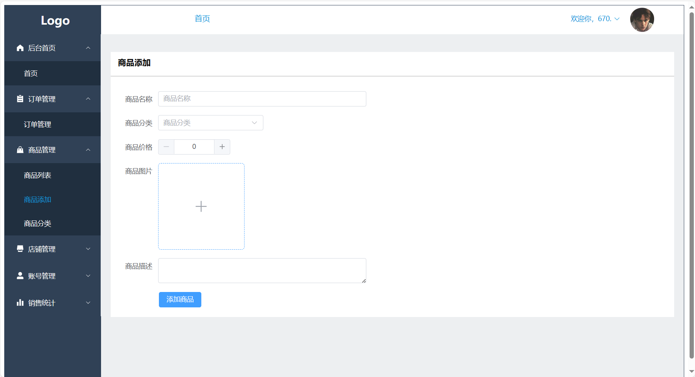
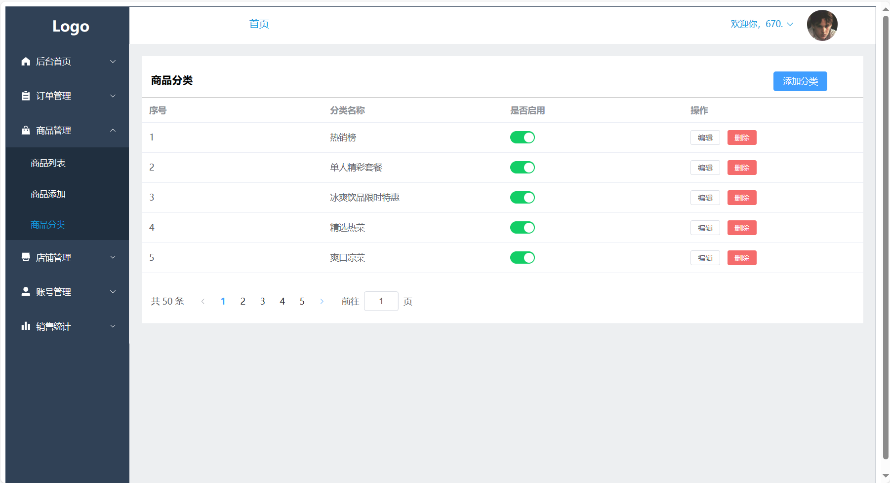

<<<<<<< HEAD
# 外卖商家中心 （Takeaway-business-center）

##### 本项目代码为前端，技术栈主要为Vue3+Elementplus+Axious+Vue-Router+Echars

外卖商家中心是为了方便对某外卖餐饮行业的商家的订单、商品信息、店铺信息、销售数据统计等数据或信息进 行管理，其主要功能模块有订单管理、商品管理、店铺管理、账号管理、销售统计。

#### 项目展示：

登录页面：

##### 首页：

##### 订单管理：

##### 商品管理：

​	商品列表：

​	商品添加：

​	商品分类：

##### 店铺管理：

##### 账号管理：

​	账号列表：

​	添加账号：

​	修改密码：

##### 销售统计：

​	商品统计：

​	订单统计：

=======
# Takeaway-business-center
外卖商家中心（前端）
>>>>>>> c2f8f0d45dca3c84c4c6b613d70dc94572428778
